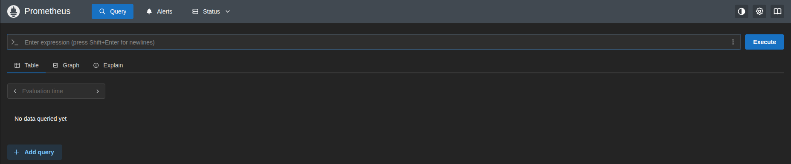
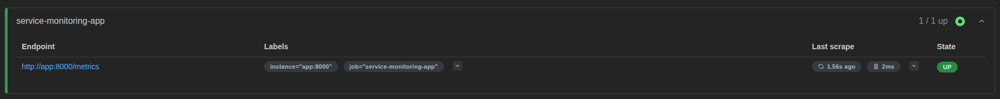
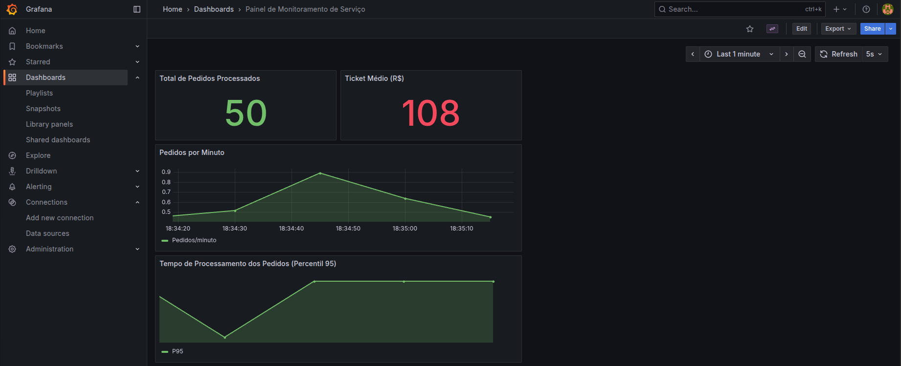

# 📊 Service Monitoring


**Service Monitoring** é um projeto desenvolvido no âmbito da organização **[DevOpsProjectsLab](https://github.com/DevOpsProjectsLab)**, com o objetivo de demonstrar o processo completo de **instrumentação de uma aplicação**, **exposição de métricas com Prometheus** e **visualização através do Grafana**, tudo orquestrado via **Docker Compose**.

---

## 🧰 Tecnologias Utilizadas

- **Python 3.12** — Aplicação simulando um serviço com métricas de negócio e desempenho  
- **Flask** — Framework HTTP leve para expor endpoints e métricas  
- **Prometheus Client Library** — Biblioteca oficial de instrumentação Prometheus para Python  
- **Prometheus** — Coleta e armazena métricas expostas pela aplicação  
- **Grafana** — Visualização das métricas em dashboards interativos  
- **Docker Compose** — Orquestração dos serviços

---

## 🏗️ Estrutura do Projeto

```bash
service-monitoring/
├── app/
│   ├── app.py               # Aplicação Python instrumentada
│   ├── requirements.txt     # Dependências do Python
│   └──  Dockerfile           # Imagem da aplicação
│
├── prometheus/
│   └── prometheus.yml       # Configuração de scrape do Prometheus
│
├── grafana/
│   ├── dashboards/          # Dashboards prontos (em português)
│   └── provisioning/        # Provisionamento automático de data source e dashboards
│
└── docker-compose.yml       # Orquestra os containers
```

---

## ⚙️ Como Funciona a Instrumentação

A aplicação utiliza a biblioteca **`prometheus_client`** para criar e expor métricas no endpoint `/metrics`.  
Essas métricas podem incluir informações técnicas (requisições, latência, usuários ativos) e de negócio (pedidos, ticket médio, tempo de processamento).

### 🔹 Benefícios da Instrumentação
- Visibilidade em tempo real da saúde do serviço  
- Diagnóstico rápido de gargalos e lentidão  
- Monitoramento de KPIs de negócio diretamente do código  
- Base para alertas e automação de respostas  

Exemplo de métrica customizada criada no código:
```python
ORDERS_TOTAL = Counter('orders_total', 'Total de pedidos processados')
ORDER_PROCESSING_TIME = Histogram('order_processing_time_seconds', 'Tempo de processamento por pedido')
AVG_ORDER_VALUE = Gauge('avg_order_value', 'Ticket médio dos pedidos')
```

---

## 📡 Prometheus & Grafana

O **Prometheus** é responsável por coletar (scrape) as métricas do endpoint `/metrics` da aplicação a cada 5 segundos, armazenando-as localmente.  



O **Grafana** se conecta ao Prometheus e apresenta essas métricas em **dashboards visuais e dinâmicos**.

### ⚙️ Subindo a Stack
```bash
docker compose up --build
```

- Aplicação Python → [http://localhost:8000](http://localhost:8000)  
- Prometheus → [http://localhost:9090](http://localhost:9090)  
- Grafana → [http://localhost:3000](http://localhost:3000)

> Login padrão do Grafana: **admin / admin**

---

## 🧪 Testando Métricas e Dashboards

Após a stack subir, você pode **gerar métricas reais** simulando requisições:

### 🔹 Gerar pedidos (métricas de negócio)
```bash
for i in {1..50}; do curl -X POST http://localhost:8000/order; echo; done
```

### 🔹 Alterar número de usuários ativos
```bash
curl http://localhost:8000/users/8
```

### 🔹 Consultar métricas expostas
```bash
curl http://localhost:8000/metrics | grep order_
```

---

## 🔍 Visualizando Métricas no Prometheus

No Prometheus UI ([http://localhost:9090](http://localhost:9090)), pesquise por expressões como:

| Métrica | Descrição |
|----------|------------|
| `orders_total` | Total de pedidos processados |
| `avg_order_value` | Ticket médio dos pedidos |
| `rate(orders_total[1m])` | Taxa de pedidos por minuto |
| `app_active_users` | Número atual de usuários ativos |



---

## 📊 Dashboard no Grafana

O **Painel de Monitoramento de Serviço** é carregado automaticamente e exibe:

- **Total de Pedidos Processados**  
- **Ticket Médio (R$)**  
- **Pedidos por Minuto**  
- **Tempo de Processamento (P95)**  
- **Usuários Ativos na Aplicação**

📍 Acesse o Grafana → Dashboards → *Painel de Monitoramento de Serviço*



> ⚠️ Caso o painel apareça como **No data**, realize um **Refresh** no dashboard (ícone 🔄 no topo direito) após realizar o comando **curl** para simular pedidos.  
> Isso força o Grafana a recarregar as métricas coletadas recentemente pelo Prometheus.

---

## 🧠 Destaques Técnicos

Este projeto demonstra na prática:
- Instrumentação customizada de serviços em Python com a biblioteca oficial prometheus_client
- Exposição segura e padronizada de métricas em formato Prometheus via endpoint /metrics
- Coleta automatizada de métricas através de configuração de scrape no Prometheus
- Visualização centralizada e interativa com dashboards Grafana totalmente em português
- Criação de métricas de negócio e desempenho, simulando cenários reais (pedidos, ticket médio, latência)
- Provisionamento automático de datasources e dashboards no Grafana via Docker Compose
- Stack completa e reproduzível de observabilidade local (Prometheus + Grafana + Flask)
- Demonstração prática de monitoramento orientado a métricas, aplicado a contextos DevOps e SRE
- A abordagem permite aplicar práticas modernas de **monitoramento orientado a métricas**, essenciais para times de **DevOps, SRE e Observabilidade**.

---

<p align="center">
  <sub>Desenvolvido e mantido por <a href="https://github.com/DevOpsProjectsLab" target="_blank">DevOpsProjectsLab</a> · Atualizado em Outubro de 2025</sub>
</p>
